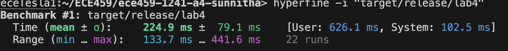
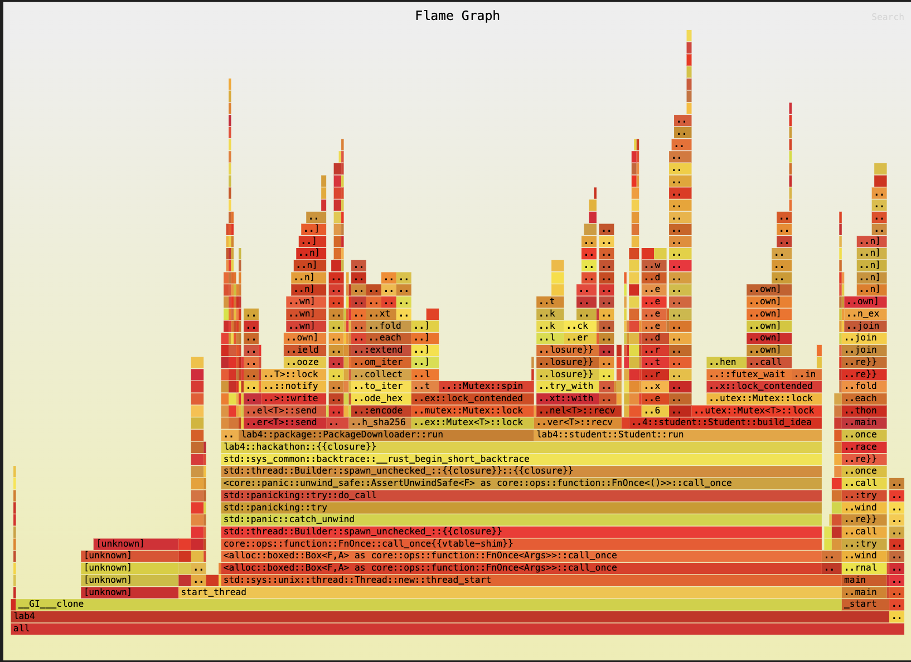
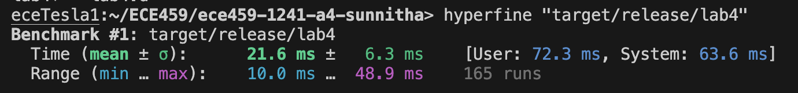
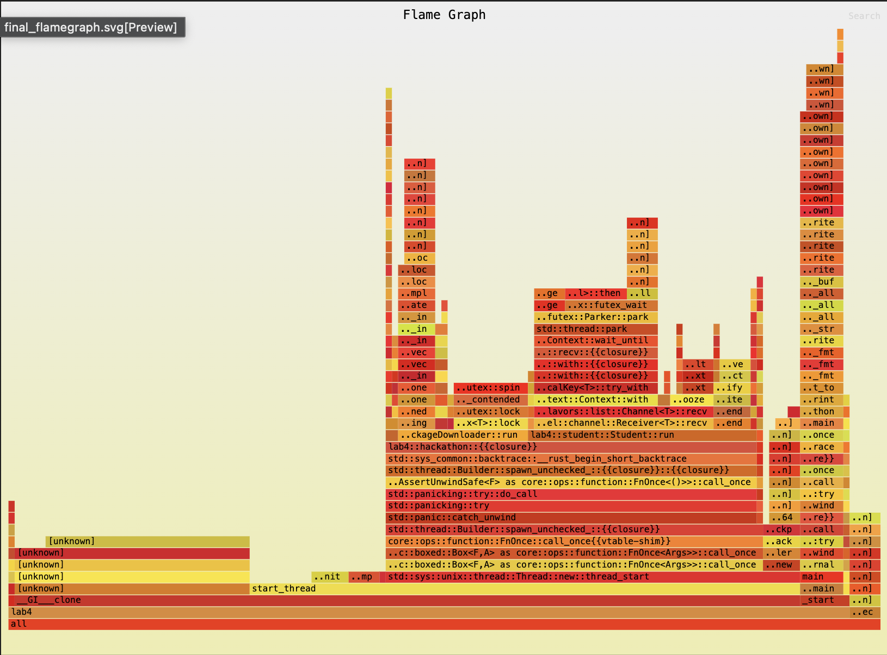

# Title

Refactoring code base to optimize for performance.

# Summary

Given a codebase that determines hackathon projects and ideas for students to work on, the goal of this assignment was to refactor the repository to optimize for perfomance. This was completed using a combination of singular file reading, buffer printing data structure, and the removal of hex encoding checksum.

# Technical details

## Single File Read
This code repository instantiates an IdeaGenerator object for each idea. During this loop, the files `ideas-customers.txt` and `ideas-products.txt` are read using `fs:read_to_string`. This is a waste of resources as these text files stay static throughout the run of each program. Hence, instead of having multiple calls to read the same file, these files were read at once at the beginning of the program and stored in a variable. The same was done for the reading of `packages.txt` which was also read multiple times each time the packages were computed for each idea. These variables were stored as arc mutex so that each thread could access this data.

## Buffer Printing
Another process which added to our flamegraph stack would be the multiple `writeln!` statements that occured once each student finalized their hackathon idea and packages. Instead of this, each print was added to a buffer variable of type `Arc<Mutex<Vec<String>>>`. This allowed us to batch all the print statements into one which lead to a singular print statement vs. multiple.

## Removal of Hex Encoding
Whenever checksum is computed, we used to hex encode each input string. This call was redundant and led to a higher flame graph stack. Instead, the encoding was removed and hence, we now store the raw value and when needed, we encode the value when `fmt::Display` is called upon.

# Testing for correctness

I compared the output from the enhanced code with that of the original sample code. When using identical data files and input parameters, both versions constructed the same projects. Additionally, the checksums presented at the conclusion did match: the idea checksum alligned with the student idea checksum, and the product checksum corresponded with the student product checksum.

# Testing for performance.

Something about how you tested this code for performance and know it is faster (about 3 paragraphs, referring to the flamegraph as appropriate.)

Two forms of testing were computed for performance. The first was by comparing the hyperfine of each version of the program. The second was by comparing the flamegraph of each version. All tests were performed on ecetesla1.

The original implementation of this program had an average runtime of `224.9 ms`. On top of this, the flamegraphs are seen to be quite tall with many thin stack traces. This indicates that our program is executing deep function call stacks. Both tests can be seen here:

The new implementation of this program now has an average run time of `21.6 ms`. This indicates a 10x improvement in performance speed. Furthermore, our new flamegraph is shown to be shorter and wider which indicates that the program utilizes multiple methods or functions but does not have excessive recursive or repeated calls to a few functions. The new tests can be seen here:

